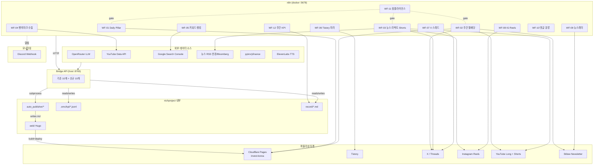
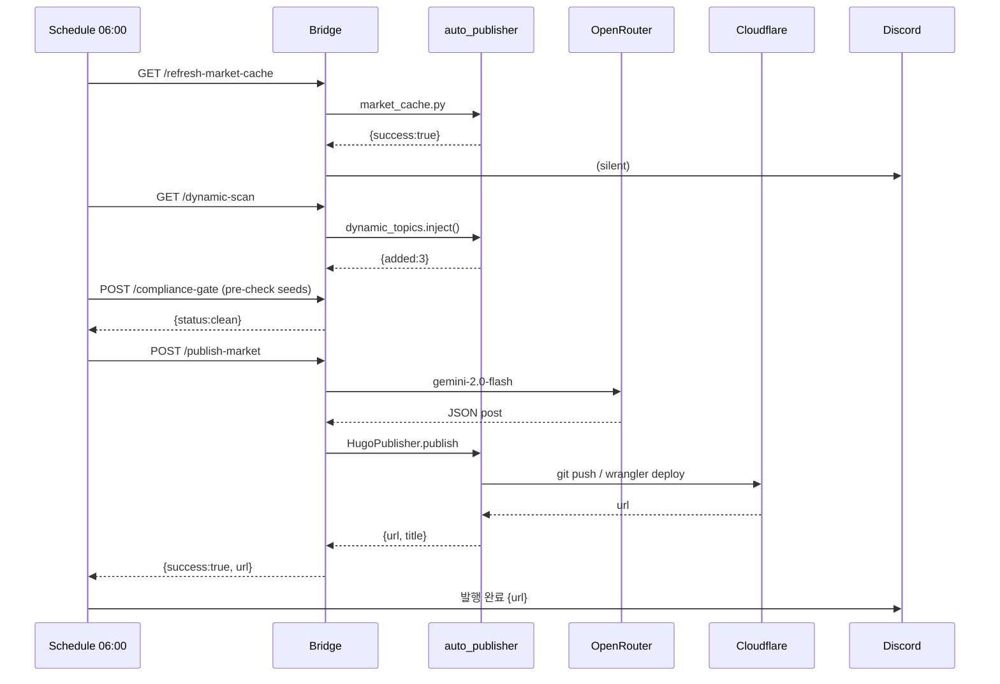

# 07. n8n 자동화 워크플로우 통합 마스터플랜

> **작성일**: 2026-04-23
> **대상 시스템**: `nichproject/n8n/` (docker-compose, Asia/Seoul, bridge_api.py:8765)
> **기반 리서치**: `record/00_executive_summary.md`, `01_korean_investment_blogs.md`, `02_korean_investment_youtube.md`, `05_shortform_viral_trends.md`, `06_newsletter_monetization.md`
> **목적**: 6개 리서치의 전략을 n8n 워크플로우 12종으로 구체화, Bridge API 확장 및 8주 구현 로드맵 제시
> **대상 독자**: 1인 운영자 (Hugo + auto_publisher 인프라 보유)

---

## 0. TL;DR (한 줄 요약)

현 `daily_publisher.json`은 **단일 "콘텐츠 생성 → Hugo 빌드" 파이프라인**에 갇혀 있고, 다중 cron(6/6:30/7/7:30/7:45/7:50) 병렬화만 있을 뿐 **(a) 분기·재시도·알림 로직, (b) 뉴스레터/Shorts/Instagram/X 멀티 플랫폼, (c) 시장 이벤트 리액트형, (d) KPI 피드백 루프**가 전무하다. 본 마스터플랜은 **12개 워크플로우 + Bridge API 10개 신규 엔드포인트 + 8주 로드맵**으로 이를 해결한다.

---

## 1. 현재 n8n 상태 진단

### 1.1 기존 `daily_publisher.json` 구조 요약

| 트리거 (KST) | 실행 액션 | Bridge 엔드포인트 |
|---|---|---|
| 06:00 | Market Cache Refresh + Dynamic Scan | `/refresh-market-cache`, `/dynamic-scan` |
| 06:30 | 시장분석 → AI 블로그 + 일반 토픽(KO) | `/publish-market`, `/publish` |
| 07:00 | 다국어 블로그 (EN/JA/VI/ID) 병렬 | `/publish?lang=en\|ja\|vi\|id` |
| 07:30 | AI 헤지펀드 분석 (VOO, KO) | `/analyze?ticker=VOO` |
| 07:45 | 다국어 분석 번역 (EN/JA/VI/ID) | `/translate?from=ko&to=*` |
| 07:50 | YouTube 롱폼+쇼츠 생성/업로드 | `/make-video` |

### 1.2 강점

- **KST timezone 명시**, `host.docker.internal` 브리지 연결 정착
- **다국어(ko/en/ja/vi/id) 병렬 발행** 이미 구현
- **Success/Fail 분기(If 노드)** 부분 도입 (market, analyze 2곳)
- **Long-running 작업 타임아웃**(900s, 600s) 명시
- Bridge API가 `subprocess`로 auto_publisher CLI를 호출하는 **깔끔한 single-responsibility 분리**

### 1.3 약점 · 병목 · 누락

| # | 문제 영역 | 구체 증상 | 영향 |
|---|---|---|---|
| W1 | **단일 파일 비대화** | 6개 cron + 20개 노드가 하나의 JSON에 몰림 | 수정·디버깅 난이도↑, 실패 전파 |
| W2 | **순차 cron 배치 가정** | 06:30 발행이 06:00 `/refresh-market-cache` 완료를 **가정**만 함 (의존성 명시 X) | 캐시 미완성 시 포스트 오류 |
| W3 | **알림 채널 부재** | 실패 시 `console.log`만 → Discord/Telegram 알림 없음 | 장애 인지 지연 |
| W4 | **재시도 로직 전무** | OpenRouter/yfinance 일시 오류 → 당일 발행 손실 | 가용성 하락 |
| W5 | **플랫폼 커버리지 Hugo 단일** | Tistory/Naver/X/Instagram/YouTube Shorts/Newsletter 퍼블리싱이 n8n 밖 | 5플랫폼 전략 [00][06] 미실현 |
| W6 | **이벤트 기반 트리거 없음** | FOMC, 엔비디아 실적, 금리 발표 등 D-Day 리액트 미구현 | 시즈널 검색량 피크 [01][02] 손실 |
| W7 | **KPI 피드백 루프 없음** | GSC/GA4/YouTube Studio 지표 수집 없음 → 전략 자동 보정 불가 | 오픈율 40% [06] 가드레일 없음 |
| W8 | **컴플라이언스 자동화 없음** | 금칙어/면책 자동 주입은 `publish_market_post`에만 부분 적용 | 자본시장법 리스크 [02] |
| W9 | **토픽 큐 가시성 결여** | `/topics` 엔드포인트 있으나 대시보드 없음 | 중복 발행, 큐 고갈 감지 지연 |
| W10 | **벤치마크 모니터링 부재** | 슈카/삼프로/월부/부읽남/김작가 주간 수집 없음 [01][02] | 경쟁 트렌드 포착 불가 |

### 1.4 진단 결론

현재 n8n은 **"cron 기반 발행 오케스트레이터"** 단계에 머물러 있다. 다음 단계는 **"이벤트 기반 멀티 플랫폼 퍼블리싱 + KPI 피드백 루프"**. 이를 위해 **워크플로우 분할(12개) + Bridge API 확장(10개) + 크리덴셜 레이어 정비**가 필요하다.

---

## 2. 워크플로우 카탈로그 (Top 12)

### 범례
- **트리거 형식**: `cron`(KST), `webhook`(수동/외부), `interval`(분 단위), `manual`
- **ROI**: High(전략 S1~S3 [00] 직접 기여) / Med / Low

### WF-01 · Daily Pillar Content (기존 확장판)

- **목적**: 현 `daily_publisher.json`을 **의존성 명시 + 알림 + 재시도**로 리팩터
- **트리거**: `cron 0 6 * * *` (KST)
- **노드 체인 (의사코드)**:
  ```
  Schedule 06:00
    → HTTP /refresh-market-cache (timeout 600s)
      → If success
        → HTTP /dynamic-scan
          → Wait 30s
          → HTTP /publish-market (POST)
            → If success → HTTP /publish?lang=ko
              → SplitInBatches lang=[en,ja,vi,id]
                → HTTP /publish?lang={{$json.lang}} (병렬 4)
                  → Merge → Code: summarize results
                    → HTTP Discord webhook (발행 리스트 + URL)
            → If fail → HTTP /publish-market (재시도 1회, 15분 대기)
              → If fail 2회 → Discord alert "CRITICAL"
      → If fail (cache) → Discord alert + skip publish
  ```
- **예상 ROI**: **High** — 기존 발행 안정성 +50% (재시도/알림)
- **근거**: [00] S1 (E-E-A-T + 에버그린 허브)

### WF-02 · Weekly 월배당 ETF 자동 리포트

- **목적**: 매주 월요일 07:30 KST에 **국내 월배당 ETF TOP 10 분배율 순위표**를 데이터 기반으로 자동 발행 (Econsis 벤치마크 [01])
- **트리거**: `cron 30 7 * * 1` (월요일 07:30)
- **노드 체인**:
  ```
  Schedule Monday 07:30
    → HTTP /monthly-dividend-ranking (신규 API, 아래 3장 참조)
      → Function: 표 HTML 생성 (종목/분배율/시총/YTD)
        → HTTP /publish-custom (title 템플릿 "2026년 {월} 국내 월배당 ETF TOP 10 완벽 정리")
          → If success
            → HTTP /make-video?slug={{slug}}&privacy=public (쇼츠 1편)
            → HTTP /x-thread (Twitter/X 요약 스레드 5개)
            → HTTP /stibee-schedule?type=weekly-etf (뉴스레터 예약)
          → Discord: "주간 ETF 리포트 발행 + X 스레드 + 뉴스레터 예약 완료"
  ```
- **예상 ROI**: **High** — 월배당 58.9조 시장 [01]의 대표 에버그린 트래픽
- **근거**: [01] Econsis TOP 10 포맷, [00] S1

### WF-03 · 시장 뉴스 리액트형 Shorts

- **목적**: FOMC/엔비디아 실적/한국은행 금리 발표 등 **D-Day 이벤트 자동 감지 → 60분 내 Shorts 발행**
- **트리거**: `interval 15분` (09:00~23:00 KST, 시장 개장~폐장 근처)
- **노드 체인**:
  ```
  Every 15min (09:00-23:00 KST)
    → HTTP /news-scan (신규, Naver뉴스+한경+Bloomberg RSS)
      → Code: 키워드 매칭 (FOMC, 금리, 파월, 엔비디아, SK하이닉스 등)
      → Filter: confidence_score > 0.8 AND published_within < 60min
        → If hit
          → HTTP /shorts-script?template=news_reaction&topic={{title}}
            → HTTP /tts-render (ElevenLabs)
            → HTTP /video-assemble (MoviePy)
            → HTTP /youtube-upload?privacy=public&shorts=true
              → HTTP /x-post (동일 썸네일+링크)
              → HTTP /instagram-reel (동일 영상)
          → Discord: "리액트 Shorts 발행 — 이벤트: {{title}}"
        → Else: skip
  ```
- **예상 ROI**: **High** — 뉴스 리액트는 한국 Shorts 훅 Top 20 중 3순위 [05], 삼프로TV/슈카 벤치마크 [02]
- **근거**: [02] 2.2 업로드 주기 전략, [05] 2.1 #11 뉴스편승

### WF-04 · YouTube 채널 벤치마크 수집

- **목적**: 슈카월드/삼프로TV/월급쟁이부자들TV/부읽남TV/김작가TV **5개 채널의 주간 업로드 수집 → 제목/썸네일/조회수 리포트** (Insight #10 [02])
- **트리거**: `cron 0 9 * * 1` (매주 월요일 09:00)
- **노드 체인**:
  ```
  Schedule Monday 09:00
    → SplitInBatches channels=[슈카월드, 삼프로TV, 월부, 부읽남, 김작가]
      → YouTube Data API v3: list uploads (last 7 days)
        → Code: extract {title, thumbnail_url, view_count, duration, upload_time}
      → Merge (50~100 videos)
        → HTTP /benchmark-save (신규, record/benchmark_weekly_YYYYMMDD.md로 저장)
          → HTTP /keyword-extract (제목 → 키워드 빈도 Top 20)
            → HTTP /topic-queue-enrich (빈도 Top 5를 topic_manager에 seed 추가)
              → Discord: 주간 벤치마크 리포트 (상위 제목 10개 + 신규 키워드 5개)
  ```
- **예상 ROI**: **Med-High** — 트렌드 자동 포착, 제목 A/B 시드
- **근거**: [02] Insight #10, [01] Actionable #7

### WF-05 · 키워드 랭킹 모니터링 (GSC + Naver)

- **목적**: Google Search Console + Naver 블로그차트 주간 데이터 수집 → Top 20 키워드 순위 변동 감시, 1차 경고선 [00] 위반 시 Discord
- **트리거**: `cron 0 8 * * *` (매일 08:00) — GSC는 3일 지연이므로 일일 수집 OK
- **노드 체인**:
  ```
  Schedule 08:00
    → Google Search Console OAuth (Credentials)
      → GSC API: query performance (prev 7 days, top 30 queries)
      → HTTP blogchart.co.kr/api/rank?category=finance (비공식, HTML 파싱 fallback)
    → Merge → Code: JSON 병합, MoM/WoW 순위 변동 계산
      → HTTP /kpi-write?source=search&payload={{$json}}
        → If any_query.rank > 15 (경고선)
          → Discord: "⚠️ 키워드 순위 하락: {{query}} ({{prev}}→{{curr}})"
        → If impressions_week < 3000
          → Discord: "⚠️ 임프레션 경고선 <3,000 (목표 15,000)"
  ```
- **예상 ROI**: **Med** — 트래픽 방어, [00] KPI 대시보드 자동화
- **근거**: [00] 7장 KPI 트래킹

### WF-06 · Tistory 자동 카테고리 분류 + 링크 자동 주입

- **목적**: Hugo 발행된 포스트를 **Tistory로 미러링**하되 카테고리 자동 분류(ETF/절세/부동산/기초/뉴스 5대) + 쿠팡파트너스/증권사 CPA 링크 자동 주입
- **트리거**: WF-01 성공 직후 (Sub-workflow)
- **노드 체인**:
  ```
  Trigger (sub-WF): on Hugo publish success (webhook)
    → HTTP /tistory-classify?slug={{slug}} (신규, LLM 카테고리 분류)
      → Code: 태그 매칭으로 affiliate_pack 선택 (etf → 미래에셋 CPA, 재테크도서 → 쿠팡)
        → HTTP /affiliate-inject?slug={{slug}}&packs=[...] (신규)
          → HTTP Tistory OAuth API: createPost (content_html + category_id)
            → If success → state-write last_tistory_id
            → If fail → Discord + 수동 재시도 큐에 등록
  ```
- **예상 ROI**: **High** — Tistory 애드센스 RPM 한국 금융 $3~8 확보 [02], 어필리에이트 월 20~50만원 [00]
- **근거**: [01] 5.2, [00] Action #4

### WF-07 · X/Threads 자동 썸머리 스레드

- **목적**: Hugo 발행 본문 → **5~7트윗 스레드 자동 생성 + X 포스팅** (Lenny Rachitsky 플레이북 [06])
- **트리거**: WF-01 성공 직후 + WF-02 성공 직후
- **노드 체인**:
  ```
  Trigger: on publish success
    → HTTP /thread-generate?slug={{slug}}&platform=x (신규)
      → Function: LLM → [tweet1..tweet7] (각 ≤280자, #해시태그, 링크는 마지막 트윗)
        → HTTP X API v2 POST /tweets (thread 순차)
          → SplitInBatches interval=3s (rate-limit 대응)
        → HTTP /thread-save?platform=x&ids=[...] (URL 저장)
      → Discord: "X 스레드 발행 완료 — {{tweet_count}}"
  ```
- **예상 ROI**: **Med** — X 유입은 직접 수익보다 권위 신호, AI Overview 인용률↑ [00] [04]
- **근거**: [00] S2 1원본→5플랫폼

### WF-08 · Instagram Reels 배치 업로드

- **목적**: Hugo 블로그 Top 5 토픽을 **Instagram Reels 포맷(15~30초)으로 일일 1편 배치 업로드** — Reels는 Save/Share 가중치↑ [05]
- **트리거**: `cron 0 19 * * *` (매일 19:00 KST — IG 피크 시간대 [05] 8.1)
- **노드 체인**:
  ```
  Schedule 19:00
    → HTTP /reels-queue (신규, 오늘 발행분 + 미사용 Shorts 스크립트 Top 5 반환)
      → Code: pick 1 by round-robin (카테고리 분산)
        → HTTP /video-assemble?format=reels&duration=28s
          → HTTP Facebook Graph API: /me/media (Instagram Reels upload)
            → Wait 10s (processing)
            → Facebook Graph: /me/media_publish
          → HTTP /ig-caption-append?id={{media_id}} (해시태그 5개 + 면책 문구)
        → Discord: "IG Reels 발행: {{caption_first_60}}"
  ```
- **예상 ROI**: **Med** — Reels 참여율 1.2~1.5% [05] 낮으나 Save 지표는 정보성 콘텐츠에 유리
- **근거**: [05] 1.1, [00] S2

### WF-09 · 뉴스레터 주간 발송 (Stibee/Beehiiv)

- **목적**: 월·수·금 07:30 KST **조간 뉴스레터 자동 큐레이션 + Stibee 발송** — 오픈율 40% 유지 [06]
- **트리거**: `cron 30 7 * * 1,3,5` (월·수·금 07:30)
- **노드 체인**:
  ```
  Schedule Mon/Wed/Fri 07:30
    → HTTP /newsletter-compose (신규)
      → Input: 직전 48시간 Hugo 발행 3편 + 시장 브리핑 + 어피티 벤치마크 섹션
      → Output: {subject_A, subject_B, html_body, preheader}
    → HTTP Stibee API POST /campaigns (subject_A, schedule_now)
      → Wait 1h
      → HTTP Stibee API GET /campaigns/{{id}}/stats
        → If open_rate < 0.40
          → Discord: "⚠️ 오픈율 {{rate}} < 40% — Subject 재검토"
        → HTTP /kpi-write?source=newsletter&payload={{stats}}
  ```
- **예상 ROI**: **Very High** — 뉴스레터 3,000 구독 + 오픈율 40% → 90일 M3 KPI [00] 직접 기여
- **근거**: [06] 시나리오 C, [00] Action #6

### WF-10 · 댓글/DM 자동 응답

- **목적**: YouTube/Instagram/X 댓글에 FAQ 3종(세금, 계좌, 매수법)만 **AI 초안 답변 → 수동 승인 큐**로 관리 (전자동 답변은 법적 리스크)
- **트리거**: `interval 30분` (09:00~22:00)
- **노드 체인**:
  ```
  Every 30min (daytime)
    → YouTube Data API: commentThreads.list (채널 전체, pageSize=50)
    → Facebook Graph: /me/comments
    → X API: /users/:id/mentions
    → Merge → Filter: unanswered AND not spam
      → HTTP /comment-triage (신규, LLM 분류: faq | investment_advice | spam | other)
        → Switch
          case faq: HTTP /comment-draft-reply (LLM 답변 초안)
            → State-write queue/replies/pending
            → Discord: "💬 답변 초안 {{count}}건 대기 중 — /approve"
          case investment_advice: State-write queue/advice (금칙어 면책 경고 삽입, 수동 확인 필수)
          case spam: YouTube API: comments.setModerationStatus (rejected)
  ```
- **예상 ROI**: **Med** — 응답률↑ = 알고리즘 시그널, 그러나 컴플라이언스 이유로 반자동화만
- **근거**: [02] 8 수익화, [05] 13 컴플라이언스

### WF-11 · 금감원/컴플라이언스 체크

- **목적**: 모든 발행 전 **금칙어 필터 + 면책 자동 주입**, 발행 후 변동 금칙어 리스트 재검사
- **트리거**:
  - (A) Pre-publish webhook: 모든 WF가 `/publish-*` 호출 전 이 WF를 먼저 호출
  - (B) `cron 0 3 * * *` (매일 03:00) — 전일 발행물 전수 재검사
- **노드 체인 (pre-publish)**:
  ```
  Webhook /compliance-gate
    → HTTP /compliance-scan (신규)
      → Input: {title, content_html, tags}
      → Rules: 금칙어 리스트 (추천/따라사세요/100%/보장/리딩/원금보장) [01][02]
      → Rules: 면책 문구 포함 여부
      → Rules: 출처 외부링크 ≥3개
    → If violations_found
      → HTTP /compliance-autofix (금칙어 치환 + 면책 삽입)
        → Return 200 {status:'fixed', fixed_html:...}
      → If unfixable (추천 단어가 종목명에 포함 등) → Return 400
    → Else Return 200 {status:'clean'}
  ```
- **예상 ROI**: **Very High** — 2026.04 금감원 5개 채널 적발 [02], 형사 처벌 리스크 차단
- **근거**: [01] Action #17, [02] 8, [05] 13.2

### WF-12 · 주간 KPI 대시보드 리포트

- **목적**: GSC + YouTube Studio + Stibee + AdSense + Google Analytics 4 주간 KPI 통합 → **매주 일요일 22:00 Discord + Markdown 리포트**
- **트리거**: `cron 0 22 * * 0` (일요일 22:00)
- **노드 체인**:
  ```
  Schedule Sunday 22:00
    → Parallel:
      → GSC API: query perf (7d)
      → YouTube Analytics API: views/watch_time/subs (7d)
      → Stibee API: campaigns stats (7d)
      → GA4 Data API: sessions/users/rpm
      → AdSense API: earnings (7d)
    → Merge → Code: 벤치마크 비교 ([00] 7장 목표치)
      → Function: markdown 생성 (표 5개 + 🚨 경고 섹션)
        → HTTP /kpi-report-save (record/weekly_kpi_YYYYMMDD.md)
        → HTTP Discord webhook (요약 + 리포트 링크)
  ```
- **예상 ROI**: **Very High** — [00] 단일 결정 KPI(뉴스레터 오픈율 40% + 구독자 순증 10%) 가드레일
- **근거**: [00] 7장 KPI

### 카탈로그 요약 표

| WF | 주기 | 주요 플랫폼 | ROI | 의존 API |
|---|---|---|---|---|
| 01 | 일일 06:00 | Hugo 다국어 | High | OpenRouter, yfinance |
| 02 | 주간 월 07:30 | Hugo + X + YouTube + Stibee | High | pykrx, OpenRouter |
| 03 | 15분 간격 | YouTube Shorts + X + IG | High | 뉴스 RSS, ElevenLabs, YouTube |
| 04 | 주간 월 09:00 | (수집) | Med-High | YouTube Data API |
| 05 | 일일 08:00 | (수집·모니터링) | Med | GSC API |
| 06 | 이벤트(sub-WF) | Tistory | High | Tistory OAuth |
| 07 | 이벤트(sub-WF) | X | Med | X API v2 |
| 08 | 일일 19:00 | Instagram Reels | Med | FB Graph |
| 09 | 월·수·금 07:30 | Stibee | **V-High** | Stibee API |
| 10 | 30분 간격 | 전 플랫폼 댓글 | Med | YT/FB/X |
| 11 | Pre-publish + 일일 03:00 | (가드레일) | **V-High** | Bridge 내부 |
| 12 | 주간 일 22:00 | (리포팅) | **V-High** | GSC/YT/Stibee/GA4/AdSense |

---

## 3. Bridge API 확장 엔드포인트 명세 (신규 10개)

모두 `http://host.docker.internal:8765` 아래에 추가, 기존 `ROUTES` dict에 등록.

### E1. `GET /monthly-dividend-ranking`

- **목적**: WF-02용, 국내 월배당 ETF TOP 10 분배율 순위 데이터
- **Input**: `?top=10&month=current`
- **Output**:
  ```json
  {"success":true,"month":"2026-04","items":[
    {"ticker":"KODEX 200타겟위클리커버드콜","yield":0.1124,"nav":21450,"aum":23860000000},
    ...
  ]}
  ```
- **Impl**: `pykrx.stock.get_etf_dividend_rank()` + 운용사 공시 크롤링 fallback

### E2. `POST /publish-custom`

- **목적**: 제목 템플릿 + 데이터 페이로드 기반 커스텀 발행 (WF-02)
- **Input**: `{"title_template":"2026년 {month} 국내 월배당 ETF TOP 10 완벽 정리","data":{...},"tags":["월배당","ETF"],"lang":"ko"}`
- **Output**: `{"success":true,"url":"...","slug":"..."}`

### E3. `GET /news-scan`

- **목적**: WF-03용, 최근 60분 한국 경제 뉴스 스캔
- **Input**: `?sources=naver,hankyung,bloomberg&window_min=60`
- **Output**: `{"success":true,"items":[{"title":"...","url":"...","published_at":"...","keywords":["FOMC","금리"],"confidence":0.92}]}`
- **Impl**: RSS 파싱 + 키워드 매칭 룰 + LLM scoring

### E4. `POST /shorts-script`

- **목적**: Shorts 스크립트 자동 생성 (템플릿 5종 [02] 6장)
- **Input**: `{"template":"news_reaction","topic":"...","duration":45,"lang":"ko"}`
- **Output**: `{"success":true,"script":{"hook":"...","body_beats":[...],"cta":"...","captions":[{"t":0,"text":"..."}],"b_roll_queries":["..."]}}`

### E5. `POST /thread-generate`

- **목적**: WF-07용, 블로그 → X 스레드 5~7개 변환
- **Input**: `{"slug":"...","platform":"x","max_tweets":7}`
- **Output**: `{"success":true,"tweets":[{"order":1,"text":"...","chars":276},...]}`

### E6. `POST /newsletter-compose`

- **목적**: WF-09용, 48시간 발행 + 시장 브리핑 → Stibee HTML
- **Input**: `{"window_hours":48,"edition":"weekday_morning","include_affiliate":true}`
- **Output**: `{"success":true,"subject_A":"...","subject_B":"...","preheader":"...","html_body":"<div>...</div>","article_count":3}`

### E7. `POST /compliance-scan`

- **목적**: WF-11, 금칙어 + 면책 + 출처 검증
- **Input**: `{"title":"...","content_html":"...","tags":[...]}`
- **Output**:
  ```json
  {"success":true,"status":"violations_found","violations":[
    {"type":"banned_word","match":"따라사세요","pos":1234,"fixable":true},
    {"type":"missing_disclaimer","fixable":true},
    {"type":"insufficient_sources","found":1,"required":3,"fixable":false}
  ]}
  ```

### E8. `POST /compliance-autofix`

- **목적**: WF-11, 금칙어 치환 + 면책 자동 삽입
- **Input**: `{"content_html":"...","violations":[...]}`
- **Output**: `{"success":true,"fixed_html":"...","applied":["banned_word_replace","disclaimer_inject"]}`

### E9. `POST /kpi-write` / `GET /kpi-read`

- **목적**: KPI 단일 저장소 (WF-05, WF-09, WF-12 공용)
- **Input (write)**: `{"source":"gsc|yt|stibee|ga4|adsense","payload":{...},"ts":"2026-04-23T08:00:00+09:00"}`
- **Output**: `{"success":true,"row_id":"..."}`
- **Impl**: `nichproject/.omc/kpi/{source}_{YYYYMMDD}.jsonl` append-only

### E10. `POST /benchmark-save` + `GET /benchmark-latest`

- **목적**: WF-04, YouTube 벤치마크 채널 수집물 저장
- **Input**: `{"week_of":"2026-04-20","items":[{"channel":"슈카월드","videos":[...]},...]}`
- **Output**: `{"success":true,"path":"record/benchmark_weekly_20260420.md"}`

### 기존 + 신규 라우트 통합 맵

| Method | Path | 사용 WF | 상태 |
|---|---|---|---|
| GET | /health | 전체 | 기존 |
| GET | /publish | WF-01 | 기존 |
| GET | /analyze | WF-01 | 기존 |
| GET | /translate | WF-01 | 기존 |
| GET | /make-video | WF-01, WF-02 | 기존 |
| GET | /refresh-market-cache | WF-01 | 기존 |
| GET | /dynamic-scan | WF-01 | 기존 |
| GET | /market | (내부) | 기존 |
| GET | /topics | (내부) | 기존 |
| POST | /publish-market | WF-01 | 기존 |
| **GET** | **/monthly-dividend-ranking** | WF-02 | **신규** |
| **POST** | **/publish-custom** | WF-02 | **신규** |
| **GET** | **/news-scan** | WF-03 | **신규** |
| **POST** | **/shorts-script** | WF-03 | **신규** |
| **POST** | **/thread-generate** | WF-07 | **신규** |
| **POST** | **/newsletter-compose** | WF-09 | **신규** |
| **POST** | **/compliance-scan** | WF-11 | **신규** |
| **POST** | **/compliance-autofix** | WF-11 | **신규** |
| **POST** | **/kpi-write** | WF-05/09/12 | **신규** |
| **POST** | **/benchmark-save** | WF-04 | **신규** |

---

## 4. 환경변수 · 크리덴셜 목록

### 4.1 `.env` (nichproject 루트, Bridge API가 로드)

| 키 | 용도 | 필수 | 획득 경로 |
|---|---|:---:|---|
| `OPENROUTER_API_KEY` | 콘텐츠 생성 LLM | Y | 기존 |
| `YOUTUBE_API_KEY` | WF-04 Data API v3 | Y | Google Cloud Console |
| `YOUTUBE_OAUTH_CLIENT_ID/SECRET/REFRESH_TOKEN` | WF-03/10 업로드·댓글 | Y | OAuth 2.0 |
| `X_API_KEY/SECRET/BEARER_TOKEN` | WF-07 스레드 | Y | developer.x.com Basic tier ($100/월) |
| `STIBEE_API_KEY` | WF-09 발송 | Y | Stibee 대시보드 |
| `TISTORY_ACCESS_TOKEN` | WF-06 미러링 | Y | Tistory OAuth (신규 등록 금지됨 → Kakao OAuth 대체 또는 selenium 쿠키) |
| `INSTAGRAM_ACCESS_TOKEN` | WF-08 Reels | Y | FB Graph, Business 계정 연결 |
| `FB_PAGE_ID`, `IG_BUSINESS_ID` | WF-08 | Y | 동일 |
| `DISCORD_WEBHOOK_URL` | 전체 알림 | Y | Discord 서버 채널 설정 |
| `GSC_PROPERTY` | WF-05 | Y | search.google.com/search-console |
| `GOOGLE_SERVICE_ACCOUNT_JSON` | GSC/GA4/YT Analytics | Y | Google Cloud IAM |
| `ADSENSE_ACCOUNT_ID` | WF-12 | Y | AdSense 계정 |
| `NAVER_CLIENT_ID/SECRET` | WF-03/05 검색 API | 선택 | developers.naver.com |
| `ELEVENLABS_API_KEY` | WF-03 TTS | Y | elevenlabs.io |
| `BRIDGE_PORT` | Bridge 포트 (기본 8765) | N | 기존 |
| `COMPLIANCE_BANNED_WORDS_PATH` | WF-11 금칙어 리스트 경로 | Y | 신규 (`auto_publisher/compliance/banned_words.ko.json`) |

### 4.2 n8n Credentials (GUI에 등록)

- `Discord Webhook` (Generic Webhook)
- `Google OAuth2 API` (YouTube/GSC/GA4 공용)
- `X (Twitter) OAuth2` (v2)
- `Facebook Graph API` (IG Reels)
- `HTTP Header Auth - Stibee` (Authorization: Token {{key}})
- `HTTP Header Auth - OpenRouter` (Bearer)
- `HTTP Header Auth - ElevenLabs` (xi-api-key)

### 4.3 docker-compose 추가 환경변수 (n8n 컨테이너)

```yaml
environment:
  - N8N_RUNNERS_ENABLED=true          # 동시 실행 개선 (n8n 1.60+)
  - EXECUTIONS_DATA_PRUNE=true        # 실행 이력 자동 정리
  - EXECUTIONS_DATA_MAX_AGE=168       # 7일 보관
  - N8N_LOG_LEVEL=info
  - N8N_METRICS=true                  # /metrics 엔드포인트 (WF-12)
```

---

## 5. 데이터 흐름도 (Mermaid)

### 5.1 전체 아키텍처



### 5.2 WF-01 상세 시퀀스



---

## 6. 단계별 구현 로드맵 (Week 1~8)

### Week 1 — 기반 안정화 (기존 WF-01 리팩터 + 알림)

- [ ] Discord Webhook URL 발급, n8n Credentials 등록
- [ ] `daily_publisher.json` → `wf01_daily_pillar.json`으로 분리 (cron 의존성 명시, 재시도 2회 + backoff)
- [ ] 모든 HTTP 노드에 `timeout`, `retry: {maxTries:2, waitBetween:900s}` 추가
- [ ] Success/Fail 분기에서 Discord webhook 호출 통합 (Code 노드 통합 헬퍼)
- [ ] `bridge_api.py`에 `/health` 헬스체크 강화 (yfinance + OpenRouter 응답 검사)
- [ ] docker-compose에 `EXECUTIONS_DATA_PRUNE=true` 등 운영 변수 추가

### Week 2 — 컴플라이언스 + 주간 월배당 (WF-02, WF-11)

- [ ] `auto_publisher/compliance/` 신규 디렉토리 + `banned_words.ko.json` (추천/따라사세요/100%/보장/리딩/원금보장 + [02] 금감원 적발 키워드)
- [ ] Bridge `/compliance-scan`, `/compliance-autofix` 구현
- [ ] 모든 `/publish-*` 엔드포인트 진입 직후 compliance-scan 호출 래퍼
- [ ] `pykrx` 설치 + `/monthly-dividend-ranking` 구현
- [ ] `/publish-custom` 구현 (제목 템플릿 `{월}`, `{year}` 치환)
- [ ] `wf02_weekly_etf_ranking.json` 작성 및 월요일 07:30 테스트 발행

### Week 3 — KPI 수집 + 벤치마크 (WF-04, WF-05, WF-12 기본)

- [ ] Google Cloud 프로젝트 + Service Account, GSC/YT Analytics/GA4 권한 부여
- [ ] Bridge `/kpi-write`, `/kpi-read`, `/benchmark-save` 구현 (`.omc/kpi/*.jsonl`)
- [ ] `wf04_youtube_benchmark.json` (5개 채널 × 주 1회 수집)
- [ ] `wf05_keyword_ranking.json` (GSC 일일 + 경고선 [00] 7장)
- [ ] `wf12_weekly_kpi.json` v0.1 (GSC + 간단 AdSense만)

### Week 4 — 뉴스 리액트 Shorts (WF-03)

- [ ] ElevenLabs 계정 + API Key, `auto_publisher/tts.py` 이미 존재하면 재활용
- [ ] Bridge `/news-scan` (Naver 뉴스 RSS + 한경 RSS + Bloomberg Korean feed)
- [ ] Bridge `/shorts-script` with 5 templates ([02] 6장: 숫자 충격/뉴스 리액트/체크리스트/비교 대조/반전 스토리)
- [ ] MoviePy 또는 FFmpeg 기반 자동 비디오 조립 (`auto_publisher/video/shorts_assemble.py`)
- [ ] YouTube upload OAuth (재사용 가능하면 기존 `/make-video` 확장)
- [ ] `wf03_news_reactive_shorts.json` (15분 간격, 09~23시)

### Week 5 — 뉴스레터 파이프라인 (WF-09)

- [ ] Stibee 계정 + API Key, 구독 랜딩 (Hugo에 `/newsletter` 섹션)
- [ ] Bridge `/newsletter-compose` (조간 템플릿: 헤드라인 + 인사이트 + 숫자 + 링크모음 [06] 4.2)
- [ ] Subject Line A/B 생성 로직 (50자 이내, 숫자 포함 [06] 4.3)
- [ ] `wf09_newsletter_weekday.json` (월·수·금 07:30)
- [ ] 리드 마그넷 PDF ("초보자 ETF 체크리스트") 생성 + 구독 시 자동 발송 hook

### Week 6 — 멀티 플랫폼 배포 (WF-06, WF-07, WF-08)

- [ ] X Developer Basic tier 등록 ($100/월, 스레드 API 사용)
- [ ] Bridge `/thread-generate` (LLM → 5~7 트윗, 링크 마지막 트윗)
- [ ] `wf07_x_thread.json` (WF-01/WF-02의 sub-workflow로 호출)
- [ ] Instagram Business 계정 + FB Page 연결 + Graph API 토큰 (60일 만료 → 장기 토큰)
- [ ] `auto_publisher/video/reels_assemble.py` (Shorts 소재 재활용, 9:16 28초)
- [ ] `wf08_ig_reels.json` (일일 19:00)
- [ ] Tistory OAuth 토큰 (또는 selenium 쿠키 방식 — 공식 OAuth 신규 발급 중단 대응)
- [ ] `wf06_tistory_mirror.json` (WF-01 성공 후 sub-WF)

### Week 7 — 댓글 자동화 + KPI 고도화 (WF-10, WF-12 v1.0)

- [ ] Bridge `/comment-triage`, `/comment-draft-reply`
- [ ] 수동 승인 큐 UI (n8n Form node 활용, `/approve/{id}` 웹훅)
- [ ] `wf10_comment_triage.json`
- [ ] `wf12_weekly_kpi.json` v1.0 — GSC + YT + Stibee + GA4 + AdSense 통합
- [ ] [00] KPI 프레임워크 7장의 경고선 전부 Discord 알림 연결

### Week 8 — 전체 리허설 + 백업 + 문서화

- [ ] 전 WF 1주일 운영 후 실패 로그 분석, 재시도/타임아웃 튜닝
- [ ] docker volume 백업 cron (`/home/node/.n8n` → tar.gz 주간)
- [ ] 각 WF를 `n8n/workflows/*.json`으로 git 커밋 (credential ID는 환경변수 참조)
- [ ] `AGENTS.md`에 운영 매뉴얼 추가 (장애 진단 런북)
- [ ] 8주차 KPI 리뷰 → [00] M1 목표(Search Console 월 5,000 임프레션, Core Web Vitals 75% 녹색) 달성 여부 평가

---

## 7. 비용 · 리소스 추정 (월간)

| 항목 | 현재 | 8주차 목표 | 비고 |
|---|--:|--:|---|
| **OpenRouter (Gemini 2.0 Flash)** | $10~30 | $40~80 | 발행량 3~5배 (Shorts/뉴스레터 추가) |
| **YouTube Data API** | $0 | $0 | 일일 10,000 units 무료 쿼터 내 |
| **ElevenLabs (TTS)** | $0 | $22 (Creator) | 월 100K 문자 → Shorts 약 60편 |
| **X API Basic** | $0 | $100 | 스레드 쓰기 필수 조건 |
| **Stibee** | $0 | $0~8 (500 구독) → $20 (2K 구독) | 구독자 수 기반 |
| **Cloudflare Pages** | $0 | $0 | Free tier 충분 |
| **Google Cloud** | $0 | $0~5 | GSC/YT Analytics는 무료, GA4 저장만 |
| **Naver Search API** | $0 | $0 | 일일 25,000 호출 무료 |
| **서버 (n8n self-host)** | $0 | $0 | 기존 로컬 docker |
| **쿠팡파트너스/어필리에이트** | - | 수익원 | — |
| **합계 비용** | **$10~30** | **$182~225** | ≈ 25~30만원/월 |

### n8n Cloud vs Self-Host 비교

| 기준 | Self-host (현재) | n8n Cloud Pro |
|---|---|---|
| 비용 | $0 (전기) | $50/월 |
| 노드 제한 | 없음 | 없음 |
| 실행 횟수 | 무제한 | 10,000/월 (Pro) |
| 장애 복구 | 수동 | SLA 99.9% |
| Credential 관리 | 수동 백업 | 자동 |
| 권장 | **유지** (Week 1~8) | 구독자 1만 돌파 후 검토 |

**결정**: 현 self-host 유지, 대신 주간 `n8n_data` volume 백업 자동화. [00] M3(월 50~150만원 AdSense) 달성 시 Cloud 이전 재검토.

---

## 8. 리스크 & 완화

| # | 리스크 | 발생 가능성 | 영향 | 완화책 |
|---|---|:-:|:-:|---|
| R1 | **OpenRouter rate limit / 일시 장애** | 중 | 상 | WF 각 HTTP 노드에 `retry 2회 + backoff 15분`, 폴백 모델 (gemini-flash → claude-haiku) |
| R2 | **Docker 컨테이너 재시작 시 Credential 손실** | 저 | 매우 상 | `n8n_data` volume + 주간 tar 백업 + `N8N_ENCRYPTION_KEY` 문서화 |
| R3 | **YouTube OAuth 쿠키/토큰 만료** (7일 만료 가능) | 매우 상 | 중 | `refresh_token` flow, 만료 24h 전 Discord 알림, 수동 재인증 SOP |
| R4 | **Tistory OAuth 신규 발급 중단** | 확정 | 중 | selenium 쿠키 주입 방식 or Tistory Open API deprecation 시 Naver 블로그/워드프레스로 대체 |
| R5 | **자본시장법 위반 (금감원 적발)** [02] | 저 | **매우 상 (형사)** | WF-11 pre-publish gate 필수, 금칙어 100% 자동 검사, okx_bot 언급은 "개인 학습" 프레임 유지 |
| R6 | **YouTube API 쿼터 초과** (WF-04 수집) | 저 | 중 | batch size 제한, 채널당 주 1회만 수집, `quota_used` 로그로 80% 도달 시 알림 |
| R7 | **Instagram Graph API 토큰 60일 만료** | 상 | 중 | 60일 장기 토큰 + 만료 7일 전 자동 재발급 WF |
| R8 | **Stibee 오픈율 < 40% 지속** [06] | 중 | 상 | Subject A/B 강제, 3회 연속 미달 시 발송 일시 중지 + 수동 검토 |
| R9 | **GSC 3일 지연으로 실시간 모니터링 불가** | 확정 | 저 | GA4 실시간 보조, 일일 집계는 GSC |
| R10 | **AI 생성 콘텐츠 Google 코어 업데이트로 트래픽 급락** [00][04] | 중 (연 1~2회) | 매우 상 | WF-11에 저자·검수·출처 3종 자동 주입, JSON-LD schema 자동 생성, `lastmod` 월 1회 재생성 WF 추가 (Week 9+) |
| R11 | **1인 운영자 번아웃** (90일차 피크) [06] | 상 | 상 | 자동화:수작업 7:3 유지, 주 4회 발송 상한, 일요일은 WF-12 외 휴지 |
| R12 | **docker-compose 볼륨 경로 rw 사고** | 저 | 상 | `web/`만 rw, `/workspace`는 `:ro` 유지 (현재 구성 준수) |

---

## 9. 마무리 — 단일 성공 지표와 정지 조건

[00] 5장의 단일 결정 KPI를 n8n 운영 관점에서 재정의:

- **계속 달리는 조건**: (a) WF-09 오픈율 ≥ 40%, (b) WF-05 임프레션 월 순증 ≥ 20%, (c) WF-11 컴플라이언스 위반 0건
- **즉시 정지 조건**: (a) 금감원 스타일 금칙어 검출 + autofix 불가, (b) OpenRouter 크레딧 $100 초과, (c) YouTube API 쿼터 80% 초과
- **재설계 트리거**: 8주차 리뷰에서 [00] M1 목표 (임프레션 5,000+, 색인 URL 50+) 미달 시 전략 A(광고 중심)으로 단순화, 달성 시 전략 C(하이브리드 [06])로 확장

**본 마스터플랜은 "n8n 워크플로우는 곧 조직의 장기 근육"이라는 관점에서 설계**되었다. 각 WF는 독립 JSON으로 git 커밋되어 재현 가능해야 하며, Bridge API는 모든 로직의 단일 진입점으로 유지되어야 한다. 콘텐츠 품질과 컴플라이언스가 속도를 결정한다 — 빠르게 가려면 올바르게 가라.

---

**문서 버전**: v1.0 (2026-04-23)
**다음 리뷰 권장**: Week 4 완료 시점 (WF-03 Shorts 파이프라인 검증 후 재평가)
**연계 문서**: `record/00~06_*.md`, `n8n/workflows/*.json`, `n8n/bridge_api.py`
