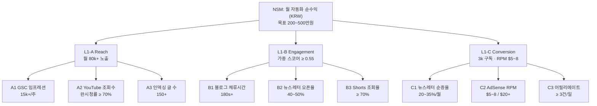
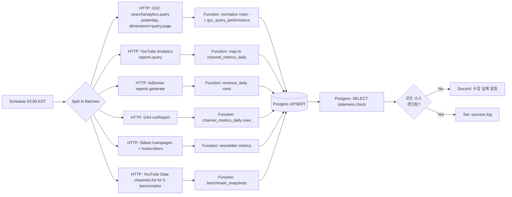
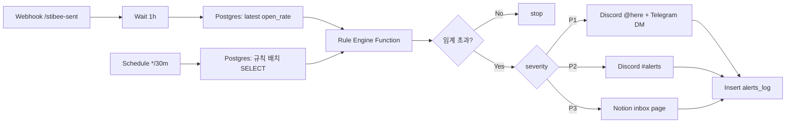

# 10. KPI 모니터링 & 벤치마크 대시보드 설계 (n8n 기반)

> **작성일**: 2026-04-23
> **작성 주체**: Analytics Reporter Agent (OMC)
> **대상 시스템**: `nichproject/` 투자·재테크 자동 퍼블리싱 파이프라인 (Hugo + auto_publisher + newsletter + YouTube Shorts)
> **기본 원칙**: *"보이지 않으면 개선되지 않는다 — 측정 없이 컨텐츠 운영 금지"*
> **연계 문서**: `record/00_executive_summary.md` §7, `record/06_newsletter_monetization.md` §9, `record/04_content_format_seo_strategy.md` §12
> **참고 인프라**: `okx_bot.py` R180 Config J 실거래 모니터링 경험 (paper mode, 15 symbols, 1h candles, risk_guard_report.json)

---

## 0. 설계 철학 (Bottom Line Up Front)

`okx_bot`은 *PF / MDD / daily return* 3개 지표로 Config J의 우위를 입증했다. 동일 원칙을 콘텐츠 운영에 이식하면 **"단 하나의 North Star + 3개 L1 + 9개 L2"** 구조로 KPI 트리가 수렴한다. 본 문서는 n8n을 *실행 엔진*으로, Postgres를 *단일 진실 원천(SSOT)* 으로 두고, Grafana 또는 Looker Studio를 *시청자용 대시보드*로 분리 배치하는 3-tier 아키텍처를 제안한다.

---

## 1. KPI 트리 — North Star + L1×3 + L2×9

### 1.1 North Star Metric (NSM)

**NSM = 월 자동화 순수익 (Monthly Net Automated Revenue, KRW)**

- 근거: `record/00 §9` "월 매출 구간 200~500만원 (AdSense 100~250 + 어필리에이트 50~150 + 뉴스레터·전자책 50~100)". `record/06 §1` "성공의 단일 KPI: 오픈율 40% + 월 순증 10%"은 *보조 게이트*로 사용.
- NSM 후보 "유료 구독자 수"는 배제: `record/06 §10-4` "유료 론칭은 무료 2만 이후" — 90일 차에는 측정 불가.
- 계산식:
  ```
  NSM = AdSense 수익 + 제휴(쿠팡/증권사 CPA) 수익 + 뉴스레터 유료 MRR
      + 유튜브 AdSense + 전자책·강의 수익 − (API 비용 + 도구 구독료)
  ```
- **측정 주기**: 일 1회 (전일 기준 집계), 월 1회 확정 (회계 마감).

### 1.2 L1 (3개 전략 축)

| L1 | 정의 | 2026-07-23 (90일 차) 목표 | 1차 경고선 |
|----|------|--------------------------|----------|
| **L1-A 트래픽 (Reach)** | 전 채널 월간 노출 총합 (블로그 PV + YouTube 조회수 + SNS 도달 + 뉴스레터 발송건수) | 월 80,000+ 노출 (Search Console 임프레션 15,000 포함 / `00 §7`) | 주간 성장률 0% 이하 |
| **L1-B 참여 (Engagement)** | 가중 참여 스코어 = 0.4×뉴스레터 오픈율 + 0.3×YouTube 완시청률 + 0.2×블로그 체류시간/180초 + 0.1×SNS 저장률 | 스코어 ≥ 0.55 | 0.40 이하 |
| **L1-C 전환 (Conversion)** | 뉴스레터 구독자 순증 + 어필리에이트 클릭 + AdSense RPM (복합 전환 지표) | 뉴스레터 3,000 구독 / AdSense RPM $5~$8 (`00 §7`) | 월 순증율 5% 이하 |

### 1.3 L2 (각 L1 아래 3개씩, 총 9개)

| 상위 | L2 지표 | 측정 단위 | 목표 (90일) | 데이터 소스 |
|------|---------|-----------|-------------|-------------|
| L1-A | A1. Search Console 임프레션 | 주간 합 | 15,000+ | GSC API |
| L1-A | A2. YouTube 월간 조회수 | 월 합 | Shorts 편당 ≥ 완시청률 70% (`00 §7`) × 30편 | YouTube Analytics API |
| L1-A | A3. 인덱싱 글 수 (색인됨) | 누적 | 150건 (ko 80 / en 40 / ja 20 / vi+id 10, `00 §9`) | GSC `/urlInspection` API |
| L1-B | B1. 블로그 평균 체류시간 | 초 | 180초+ (`00 §7` "3분+") | GA4 / Plausible |
| L1-B | B2. 뉴스레터 오픈율 | % | 40~50% (`00 §7`, `06 §1`) | Stibee API |
| L1-B | B3. YouTube Shorts 평균 조회율 | % | ≥ 70% (`00 §7` 알고리즘 분기점) | YouTube Analytics API |
| L1-C | C1. 뉴스레터 구독자 순증율 | %/월 | 20~35%/월 (`00 §7`) | Stibee API |
| L1-C | C2. AdSense RPM | $ | $5~$8 한국 / $20+ Tier-1 (`00 §7`) | AdSense Management API |
| L1-C | C3. 어필리에이트 전환 (쿠팡 CVR + 증권사 CPA 건수) | 건/일 | ≥ 3건/일 | 쿠팡파트너스 API, 각 CPA 제휴사 리포트 |

### 1.4 KPI 트리 Mermaid



---

## 2. 채널별 핵심 지표표

### 2.1 블로그 (Hugo + AdSense)

| 지표 | 소스 | 수집 주기 | 경고 조건 | 목표 |
|------|------|-----------|-----------|------|
| PV (Page Views) | Plausible/GA4 | 일 1회 | 전일 대비 -30% | 일 2,000~3,000 (`01 §5.3`) |
| UV (Unique Visitors) | Plausible/GA4 | 일 1회 | 전주 대비 -25% | — |
| 평균 체류시간 | Plausible/GA4 | 일 1회 | <90초 3일 연속 | 180초+ (`00 §7`) |
| 이탈률 (Bounce) | GA4 | 주 1회 | >75% | <60% |
| 색인된 글 수 | GSC `urlInspection` | 일 1회 | 72h 동안 0건 증가 | 150+ (`00 §9`) |
| GSC 평균 CTR (쿼리) | GSC API | 주 1회 | <1.5% | 3~5% |
| 상위 10 키워드 순위 | GSC API | 주 1회 | TOP 10 이탈 시 (`01 §7`) | ≤10위 (`00 §7`) |
| Core Web Vitals (LCP/INP/CLS) | PSI API | 주 1회 | Good % <60% | 75%+ (`00 §7`) |

### 2.2 YouTube (Long-form + Shorts 서브 채널)

| 지표 | 소스 | 주기 | 경고 조건 | 목표 |
|------|------|------|-----------|------|
| 구독자 | YouTube Analytics API | 일 1회 | 일 순증 ≤ 0 (3일 연속) | 1,000+ (`00 §9`) |
| 월간 조회수 | YouTube Analytics API | 일 1회 | 전월 대비 -20% | — |
| 시청 시간 (분) | YouTube Analytics API | 일 1회 | 주간 <1,000분 | AdSense 요건 4,000시간 누적 (`02 §8`) |
| CTR (인상률) | YouTube Analytics API | 주 1회 | <3% | 6%+ |
| 평균 조회율 | YouTube Analytics API | 주 1회 | <2% (쇼츠) / <40% (long) | ≥ 70% (Shorts, `00 §7`) |
| Shorts 대비 롱폼 비율 | YouTube Data API | 주 1회 | Shorts >90% (포지셔닝 이탈) | 런칭기 Shorts 7~10편 + long 1~2편/주 (`00 §7`) |
| 팔로우 전환율 | YT Analytics | 주 1회 | <0.5% | 1.5%+ (`00 §7`) |

### 2.3 Instagram / X (SNS)

| 지표 | 소스 | 주기 | 경고 조건 | 목표 |
|------|------|------|-----------|------|
| 팔로워 수 | IG Graph API / X API v2 | 일 1회 | 순증 ≤ 0 (5일 연속) | — |
| 도달 (Reach) | IG Graph API / X Analytics | 주 1회 | 전주 -30% | — |
| 저장 (Saves) / 북마크 | IG Graph API / X API | 주 1회 | 피드당 <1% | — |
| 공유 (Shares) | IG Graph API / X API | 주 1회 | 0 (7일 연속) | — |

> X API v2는 월 $100 티어부터 필수 지표 조회 가능. IG는 Graph API + Business 계정 필수.

### 2.4 뉴스레터 (Stibee 주력)

| 지표 | 소스 | 주기 | 경고 조건 | 목표 |
|------|------|------|-----------|------|
| 구독자 수 | Stibee API | 일 1회 | 순증율 <5%/월 (`00 §7`) | 90일 3,000 (`06 §9`) |
| 오픈율 | Stibee API (발송 webhook) | 발송당 | 25% 이하 3회 연속 | 40~50% (`06 §1`) |
| CTR (본문 링크 클릭) | Stibee API | 발송당 | <3% (`00 §7`) | 5~10% |
| 해지율 | Stibee API | 월 1회 | >3%/월 (`00 §7`) | <1.5%/월 |
| 유료 전환율 (무료→Plus) | 네이버 프리미엄콘텐츠 + Stibee cross-ref | 월 1회 | <2% (무료 20k+ 이후) | 5% (`06 §8` 시나리오 C) |
| Subject A/B 승자 lift | Stibee A/B 테스트 리포트 | 발송당 | 패자 lift <0 2회 | — |

### 2.5 수익 (Revenue)

| 지표 | 소스 | 주기 | 경고 조건 | 목표 |
|------|------|------|-----------|------|
| AdSense RPM | AdSense Management API | 일 1회 | <$2 | $5~$8 한국 / $20+ Tier-1 (`00 §7`) |
| AdSense 일 수익 | AdSense API | 일 1회 | 전주 평균 -40% | — |
| 쿠팡파트너스 CVR | 쿠팡 파트너스 리포트 스크래핑 | 일 1회 | <1% | — |
| 증권사 CPA 건수 | 파트너사 리포트 (수동 + 가능 시 API) | 주 1회 | 0 (7일) | 월 20~50건 |
| 제휴 수익 합계 (KRW) | 통합 집계 | 일 1회 | — | 월 20~150만원 (`00 §6 M3`) |
| 뉴스레터 유료 MRR | Stibee / 네이버 PC | 월 1회 | 신규 MRR <추가 목표 | 90일 MVP 설계, 6개월 1,000 유료 |

---

## 3. 데이터 수집 아키텍처

### 3.1 데이터 소스 매트릭스

| 소스 | 방식 | 인증 | 주기 | 쿼터/비용 |
|------|------|------|------|-----------|
| Google Search Console API | REST (`searchanalytics.query`, `urlInspection.inspect`) | OAuth2 (서비스 계정) | 일 1회 + 주간 집계 | 1,200 rpm / 무료 |
| YouTube Analytics API v2 + YouTube Data API v3 | REST | OAuth2 | 일 1회 | 10,000 units/일 무료 |
| AdSense Management API v2 | REST | OAuth2 | 일 1회 | 무료 |
| Naver Search Ad API | REST (`/keywordstool`) | API key (HMAC signed) | 주 1회 (검색량 트렌드) | 무료 할당량 내 |
| Tistory RSS / Hugo RSS | 단순 GET (XML) | 없음 | 실시간 (트리거) | 무료 |
| Stibee API | REST (`/campaigns`, `/subscribers`) | API key | 발송 webhook + 일 1회 | 무료 티어 내 |
| Plausible | REST (`/api/v1/stats`) | Bearer token | 일 1회 | 자가호스팅 무료 / Cloud $9+/월 |
| GA4 Data API | REST | OAuth2 서비스 계정 | 일 1회 | 무료 (25,000 tokens/일) |
| PageSpeed Insights API | REST | API key | 주 1회 | 25,000 rpd 무료 |
| 쿠팡파트너스 리포트 | 로그인 스크래핑 (공식 API 없음) | 세션 쿠키 | 일 1회 | 주의: ToS 준수 |
| YouTube (벤치마크 채널) | YouTube Data API v3 (`channels.list`, `search.list`) | API key | 일 1회 | 10,000 units/일 |

### 3.2 수집 주기 3단 구조

- **실시간 (webhook)**: Stibee 발송 완료, Hugo `hugo --watch`로 새 글 배포 트리거
- **일 1회 (야간 배치, 03:00 KST)**: GSC / YouTube / AdSense / GA4 / 벤치마크 채널
- **주 1회 (월 09:00)**: Naver Search Ad 키워드 트렌드, CWV, 주간 리포트 생성

### 3.3 저장소 — Postgres 권장

- **결정**: n8n 내장 SQLite ✗, **외부 Postgres 15+ ✓**.
- 근거:
  - n8n 워크플로우는 stateless로 두고 데이터는 영속 레이어에 분리 (운영 안정성)
  - 시계열 쿼리 (7d/30d/90d rolling average)와 Grafana/Looker Studio 직접 연결 용이
  - 멀티 테이블 JOIN (블로그 포스트 × GSC 쿼리 × 수익) 빈번
  - `okx_bot` 운영 경험(`risk_guard_report.json` stale로 인한 전체 봇 정지)과 동일 교훈 — *파일 기반 state 지양*
- 배치: Docker Compose로 n8n + Postgres + Grafana 3-컨테이너 스택 (`.omc/compose/`)

### 3.4 SQL 스키마 초안 (5개 주요 테이블)

```sql
-- 1. 포스트 마스터 테이블 (SSOT for content)
CREATE TABLE posts (
    post_id         SERIAL PRIMARY KEY,
    slug            VARCHAR(255) UNIQUE NOT NULL,
    title           TEXT NOT NULL,
    url             TEXT NOT NULL,
    language        CHAR(2) NOT NULL,                  -- ko/en/ja/vi/id
    category        VARCHAR(64),                        -- etf/tax/realestate/...
    pillar_type     VARCHAR(32),                        -- pillar/cluster/news/comparison
    word_count      INTEGER,
    published_at    TIMESTAMPTZ NOT NULL,
    last_mod_at     TIMESTAMPTZ,
    indexed_at      TIMESTAMPTZ,                        -- GSC 색인 확인 시각
    schema_flags    JSONB,                              -- {article:1, faqpage:1, breadcrumb:1}
    created_at      TIMESTAMPTZ DEFAULT NOW()
);
CREATE INDEX idx_posts_lang_pub ON posts(language, published_at DESC);

-- 2. 일별 채널 메트릭 (좁은·긴 형식 — wide→long)
CREATE TABLE channel_metrics_daily (
    metric_date     DATE NOT NULL,
    channel         VARCHAR(32) NOT NULL,               -- blog/youtube/instagram/x/newsletter
    metric_key      VARCHAR(64) NOT NULL,               -- pv, uv, watch_time_min, open_rate
    metric_value    NUMERIC(18,4) NOT NULL,
    unit            VARCHAR(16),                        -- count, pct, sec, krw, usd
    source          VARCHAR(32),                        -- gsc, ga4, yt_analytics, stibee
    collected_at    TIMESTAMPTZ DEFAULT NOW(),
    PRIMARY KEY (metric_date, channel, metric_key)
);
CREATE INDEX idx_cmd_channel_key ON channel_metrics_daily(channel, metric_key, metric_date DESC);

-- 3. 검색 쿼리 성과 (GSC 상세)
CREATE TABLE gsc_query_performance (
    metric_date     DATE NOT NULL,
    page_url        TEXT NOT NULL,
    query           TEXT NOT NULL,
    impressions     INTEGER NOT NULL,
    clicks          INTEGER NOT NULL,
    ctr             NUMERIC(6,4),                       -- 0.0000~1.0000
    avg_position    NUMERIC(6,2),
    country         CHAR(3),
    device          VARCHAR(16),
    PRIMARY KEY (metric_date, page_url, query, country, device)
);
CREATE INDEX idx_gsc_query ON gsc_query_performance(query, metric_date DESC);

-- 4. 수익 트랜잭션 (일별 채널별 수익)
CREATE TABLE revenue_daily (
    metric_date     DATE NOT NULL,
    source          VARCHAR(32) NOT NULL,               -- adsense, coupang, securities_cpa, newsletter_paid
    currency        CHAR(3) NOT NULL,                   -- USD/KRW
    gross_amount    NUMERIC(14,2) NOT NULL,
    net_amount      NUMERIC(14,2),                      -- after fees
    events_count    INTEGER,                            -- clicks, conversions, paid subs
    rpm             NUMERIC(10,4),                      -- for adsense
    cvr             NUMERIC(6,4),                       -- conversion rate
    metadata        JSONB,
    PRIMARY KEY (metric_date, source, currency)
);

-- 5. 벤치마크 채널 스냅샷 (5대 채널)
CREATE TABLE benchmark_snapshots (
    snapshot_date   DATE NOT NULL,
    benchmark_id    VARCHAR(32) NOT NULL,               -- shuka/sampro/weolbu/booknam/kimjakga
    channel_kind    VARCHAR(16) NOT NULL,               -- youtube/blog/newsletter
    subscribers     BIGINT,
    weekly_uploads  INTEGER,
    avg_views_7d    BIGINT,
    top_title       TEXT,
    top_title_views BIGINT,
    raw_payload     JSONB,                              -- 원본 응답 보존
    PRIMARY KEY (snapshot_date, benchmark_id, channel_kind)
);
```

---

## 4. n8n 워크플로우 청사진 (3종)

### 4.1 WF-1: 일일 KPI 수집 워크플로우 (`wf_daily_kpi_collect`)

**트리거**: Schedule Trigger — `cron: 0 18 * * *` (UTC) = 03:00 KST



**핵심 노드 의사코드**:

```javascript
// Function node: GSC row normalizer
// input items: rows from searchanalytics.query
return items.flatMap(it => it.json.rows.map(r => ({
  json: {
    metric_date: $json.startDate,
    page_url: r.keys[1],
    query: r.keys[0],
    impressions: r.impressions,
    clicks: r.clicks,
    ctr: r.ctr,
    avg_position: r.position,
    country: 'KOR',
    device: 'ALL'
  }
})));

// Postgres node: UPSERT
INSERT INTO gsc_query_performance
  (metric_date, page_url, query, impressions, clicks, ctr, avg_position, country, device)
VALUES ($1,$2,$3,$4,$5,$6,$7,$8,$9)
ON CONFLICT (metric_date, page_url, query, country, device) DO UPDATE
  SET impressions = EXCLUDED.impressions,
      clicks      = EXCLUDED.clicks,
      ctr         = EXCLUDED.ctr,
      avg_position= EXCLUDED.avg_position;
```

### 4.2 WF-2: 주간 리포트 생성 (`wf_weekly_report`)

**트리거**: Schedule — `cron: 0 0 * * 1` (월 09:00 KST)

**처리 단계**:
1. Postgres `SELECT`: 전주 7일 집계 (KPI 트리 전체 L1/L2 + 채널별 요약)
2. Postgres `SELECT`: 벤치마크 5사 vs 자사 Δ 계산
3. Function 노드: Markdown 템플릿 렌더링 (`record/benchmark_weekly_YYYYMMDD.md` 형식)
4. 분기:
   - Discord webhook (짧은 요약 + 링크)
   - Slack webhook (세부 표)
   - Notion API (`database.pages.create`)로 주간 페이지 자동 생성
   - Git 노드로 `record/` 아래 마크다운 커밋 (PR 형태로)

**Markdown 템플릿 pseudocode**:
```javascript
const body = `# Weekly KPI Report (${weekStart} ~ ${weekEnd})

## NSM
- Net Revenue: ${fmtKRW(nsm)}  (WoW ${pct(wowNsm)})

## L1
- Reach: ${reach}  (WoW ${pct(wowReach)})
- Engagement Score: ${engScore.toFixed(3)}  (target 0.55)
- Conversion: RPM $${rpm}, subs +${newSubs}

## L2 (top/bottom 3)
${renderL2Table(l2Rows)}

## Benchmark gap
${renderBenchmarkTable(bmRows)}

## Alerts fired (7d)
${renderAlertLog(alerts)}
`;
```

### 4.3 WF-3: 이상치 실시간 알림 (`wf_anomaly_alert`)

**트리거 2종**:
- Webhook Trigger (Stibee 발송 완료 → 오픈율 1h 후 재측정)
- Schedule — `cron: */30 * * * *` (30분마다 규칙 평가)



**규칙 엔진 의사코드** (Function 노드):
```javascript
const rules = [
  { id:'PV_DROP_30', sql:`
      SELECT SUM(CASE WHEN metric_date=CURRENT_DATE-1 THEN metric_value END) AS yday,
             AVG(metric_value) FILTER(WHERE metric_date BETWEEN CURRENT_DATE-8 AND CURRENT_DATE-2) AS base
        FROM channel_metrics_daily
       WHERE channel='blog' AND metric_key='pv'`,
    fire: r => r.yday < r.base * 0.7, severity:'P1' },
  { id:'NL_OPEN_25_3x', sql:`
      SELECT metric_value FROM channel_metrics_daily
       WHERE channel='newsletter' AND metric_key='open_rate'
       ORDER BY metric_date DESC LIMIT 3`,
    fire: rows => rows.every(r => r.metric_value <= 0.25), severity:'P1' },
  { id:'YT_VIEW_RATIO_2PCT', sql:`
      SELECT AVG(metric_value) AS avg7 FROM channel_metrics_daily
       WHERE channel='youtube' AND metric_key='avg_view_ratio'
         AND metric_date > CURRENT_DATE-7`,
    fire: r => r.avg7 < 0.02, severity:'P2' },
  { id:'KW_TOP10_DROP', sql:`
      SELECT query, MIN(avg_position) AS best, MAX(avg_position) AS now
        FROM gsc_query_performance
       WHERE metric_date > CURRENT_DATE-14
       GROUP BY query HAVING MIN(avg_position) <= 10 AND MAX(avg_position) > 10`,
    fire: rows => rows.length > 0, severity:'P2' }
];
```

---

## 5. 경고 임계값 예시 (Alert Rules)

| ID | 조건 | 심각도 | 채널 | 액션 |
|----|------|:------:|------|------|
| **AL-01** | 일 PV -30% (7일 이동평균 대비) | P1 | Discord @here + Telegram | 24h 내 원인 분석 (GSC 변화 / 서버 장애 / 코어 업데이트) |
| **AL-02** | 핵심 키워드 TOP 10 이탈 (2주 내 최고 vs 현재) | P2 | Discord #alerts | 해당 URL lastmod + 내부링크 보강 queue 등록 |
| **AL-03** | 뉴스레터 오픈율 ≤ 25% 3회 연속 | P1 | Discord + Stibee 어드민 링크 | Subject A/B 재설계, 발송 시간 조정 (`06 §4.3`) |
| **AL-04** | YouTube 7일 평균 조회율 ≤ 2% | P2 | Discord | 썸네일/훅 재편집 queue, `02 §5` 훅 유형 재적용 |
| **AL-05** | AdSense RPM ≤ $2 (7일) | P2 | Discord + Notion | 광고 배치 점검 (`04 §7.2`) |
| **AL-06** | 색인 글 수 72h 동안 증가 0건 | P2 | Discord | GSC `urlInspection` 일괄 재요청 |
| **AL-07** | 쿠팡파트너스 CVR <0.5% (7일) | P3 | Notion inbox | 링크 위치·상품 선정 리뷰 |
| **AL-08** | 뉴스레터 해지율 >3%/월 | P1 | Discord | 직전 4주 발송 retrospect (`00 §7`) |
| **AL-09** | 벤치마크 채널 주간 조회수 격차 확대 (Δ > 2σ) | P3 | Notion | 포맷 benchmarking |
| **AL-10** | Core Web Vitals Good % <60% | P2 | Discord | Hugo 이미지 파이프라인 점검 (`04 §6`) |

규칙은 모두 `alert_rules` 테이블(별도 생성)에 **SQL + 임계 + severity**로 저장하여 코드 수정 없이 튜닝 가능하게 한다 (`okx_bot`의 `risk_guard_report.json` 교훈 반영 — 단, 파일 대신 DB에 기록).

---

## 6. 벤치마크 비교 프레임워크

### 6.1 5대 벤치마크 채널

| 벤치마크 | YouTube | 블로그/뉴스레터 | 참고 구독자 | 역할 |
|----------|---------|-----------------|------------|------|
| 슈카월드 (`02 §1`) | UCsJ6RuBiTVWRX156FVbeaGg | antok.co.kr | 360만 | Top-tier Long-form, 숫자 충격형 제목 |
| 삼프로TV (`02 §1`) | UChlv4GSd7OQl3js-jkLOnFA | 삼프로 뉴스레터 (`06 §1`) | 250만 | 라이브·인터뷰 포맷 |
| 월급쟁이부자들 (`02 §1`) | @weolbu_official | weolbu.com | 200만 | 커뮤니티·스토리형 |
| 부읽남TV (`02 §1`) | (채널 ID) | — | 180만 | 부동산 Niche |
| 김작가TV (`02 §1`) | UCvil4OAt-zShzkKHsg9EQAw | — | 260만 | 인터뷰 포맷 |

### 6.2 주간 수집 지표 (공개)

- YouTube: `subscribers`, `weekly_uploads`, `avg_views_7d` (최근 7편), `top_title`, `top_title_views`
- 블로그(공개된 경우): RSS로 주간 게시 수 + 제목 추출

### 6.3 격차 트래킹 표 (SQL 뷰)

```sql
CREATE OR REPLACE VIEW v_benchmark_gap AS
WITH ours AS (
  SELECT metric_date,
         SUM(metric_value) FILTER (WHERE channel='youtube' AND metric_key='subscribers') AS yt_subs,
         SUM(metric_value) FILTER (WHERE channel='youtube' AND metric_key='views_7d') AS yt_views_7d
    FROM channel_metrics_daily
   GROUP BY metric_date
),
bm AS (
  SELECT snapshot_date, benchmark_id,
         MAX(subscribers) AS bm_subs,
         MAX(avg_views_7d*7) AS bm_views_7d
    FROM benchmark_snapshots
   WHERE channel_kind='youtube'
   GROUP BY snapshot_date, benchmark_id
)
SELECT b.snapshot_date, b.benchmark_id,
       o.yt_subs, b.bm_subs, (o.yt_subs::float/NULLIF(b.bm_subs,0)) AS subs_ratio,
       o.yt_views_7d, b.bm_views_7d,
       (o.yt_views_7d::float/NULLIF(b.bm_views_7d,0)) AS views_ratio
  FROM bm b
  LEFT JOIN ours o ON o.metric_date = b.snapshot_date;
```

출력 예시 (주간 리포트 삽입):

| 날짜 | 벤치마크 | 자사/BM 구독자 비 | 자사/BM 7d 조회수 비 |
|------|---------|-------------------|---------------------|
| 2026-W18 | shuka | 0.0003 | 0.0001 |
| ... | ... | ... | ... |

격차 축소 속도(2차 도함수)가 양(+)이면 *추격 진행*, 음(-)이면 *포맷/주제 재설계 트리거*.

---

## 7. 대시보드 시각화 권장

| 도구 | 장점 | 단점 | 추천 역할 |
|------|------|------|----------|
| **Notion** | 주간 리포트 공유·협업·코멘트 | 실시간성·차트 한계 | 주간/월간 리포트 아카이브 (`record/`와 연동) |
| **Grafana** | 시계열 시각화 끝판왕, 알림 통합 | 비즈 지표 표현 제한 | 엔지니어용 운영 대시보드 (Postgres 직결) |
| **n8n Dashboard (Beta)** | 워크플로우와 일체 | 그래프 기능 초기 단계 | 워크플로우 상태·수집 성공률 모니터 |
| **Looker Studio** | 무료, GSC/GA4/YouTube 네이티브 커넥터, 공유 URL | 커스텀 계산 제한, 새로고침 속도 | 경영자 대시보드 (NSM + L1 3종) |

**권장 조합 (3-layer)**:
- **Layer 1 경영(주 1회)**: Looker Studio — NSM + L1 3개 KPI + 목표 대비 진척
- **Layer 2 운영(상시)**: Grafana — L2 9개 + 채널별 시계열 + 알림 규칙 상태
- **Layer 3 협업(이슈 단위)**: Notion — 주간 리포트 + 경고 대응 액션 아이템

---

## 8. 구현 우선순위 (Week 1~4)

| 주차 | 산출물 | 담당 파일/서비스 |
|------|--------|------------------|
| **Week 1 (기반)** | (a) Docker Compose로 n8n + Postgres + Grafana 스택, (b) SQL 스키마 5종 마이그레이션, (c) OAuth 크레덴셜 볼트(n8n Credentials) | `docker/kpi-stack/docker-compose.yml`, `db/migrations/001_kpi.sql` |
| **Week 2 (수집)** | WF-1 구현: GSC / GA4·Plausible / AdSense / Stibee 순으로 단일 API씩 E2E 완결. 각 소스당 샘플 일 1회 수집 성공 | `n8n/workflows/wf_daily_kpi_collect.json` |
| **Week 2~3 (확장)** | YouTube Analytics + 벤치마크 5채널 수집 + 쿠팡파트너스 스크래퍼 (Playwright on n8n) | 동일 WF-1 + `n8n/workflows/wf_benchmark.json` |
| **Week 3 (리포트)** | WF-2 주간 리포트 → Discord + Notion 동시 발송, `record/benchmark_weekly_YYYYMMDD.md` 자동 커밋 | `n8n/workflows/wf_weekly_report.json` |
| **Week 3~4 (알림)** | WF-3 이상치 감지 + 10종 규칙 DB 적재 + Discord 연동 | `n8n/workflows/wf_anomaly_alert.json`, `db/migrations/002_alerts.sql` |
| **Week 4 (시각화)** | Looker Studio 대시보드 3개 (NSM / 채널별 / 벤치마크), Grafana 대시보드 JSON | `dashboards/looker_*.json`, `dashboards/grafana_*.json` |
| **Week 4 (검증)** | 7일 데이터 축적 후 KPI 트리 숫자 검증, 오경보율 <5% 튜닝 | 회고 문서 `record/10b_kpi_week4_retrospect.md` |

**MVP 판정 기준**: Week 4 종료 시점에 (1) NSM 일 1회 자동 계산, (2) L1/L2 모두 DB 조회 가능, (3) WF-1/2/3 연속 7일 무중단 실행, (4) 주간 리포트 1회 자동 배포.

---

## 9. 예상 구현 비용 / 공수

### 9.1 월간 운영비

| 항목 | 비용 (월, KRW) | 비고 |
|------|---------------:|------|
| n8n (self-host, VPS 공용) | 0 | 기존 bridge_api 인프라 재활용 |
| Postgres (self-host) | 0 | 동일 VPS |
| Grafana (self-host) | 0 | OSS |
| Looker Studio | 0 | Google 무료 |
| Plausible Cloud (선택) | 약 12,000 | 자가호스팅 시 0 |
| Stibee | 0~8,900 | 500명까지 무료 (`06 §6`) |
| Twitter/X API Basic | 약 140,000 | $100/월 (필수 시) |
| IG Graph API | 0 | Business 계정 무료 |
| 기타 API (GSC/GA4/YT/AdSense/PSI) | 0 | 무료 쿼터 내 |
| **합계 (최소)** | **약 0~20,000원** | SNS 제외 시 |
| **합계 (X 포함)** | **약 140,000~160,000원** | 런칭 초기는 미포함 권장 |

### 9.2 개발 공수 (1인 운영자 기준)

| 단계 | 시간 | 비고 |
|------|-----:|------|
| 스택 셋업 (Docker/n8n/Postgres) | 8h | Week 1 |
| 스키마·마이그레이션 | 4h | Week 1 |
| OAuth 크레덴셜 수집 + 테스트 | 6h | GSC/GA4/YT/AdSense 각 1~2h |
| WF-1 수집 워크플로우 | 20h | 소스별 4h × 5 |
| 벤치마크 수집 | 6h | Week 2~3 |
| WF-2 주간 리포트 | 10h | Markdown 렌더 + 3종 발송 |
| WF-3 이상치 알림 + 10 규칙 | 12h | 규칙 DB + Function |
| Looker Studio / Grafana | 10h | 대시보드 3개 |
| QA · 튜닝 | 8h | Week 4 |
| **총계** | **84h** | 1인 주 20h 기준 약 **4주** |

### 9.3 숨은 비용·리스크

- **쿠팡파트너스 공식 API 부재** → 스크래퍼 유지보수 부담 (UI 변경 시 즉시 장애). 대안: 수동 CSV 일 1회 업로드 n8n `Read Binary File`.
- **YouTube Data API 쿼터 10k units/일**: 벤치마크 5채널 × 매일 이중 쿼리 시 약 500 units — 여유.
- **X API Basic**: 월 $100 지속 부담. *90일 내 팔로워 <1,000이면 해당 채널 KPI 일단 제외*.
- **구독자 이메일 주소 등 PII**: `subscribers` 테이블에는 id·해시만 저장, 원본 PII는 Stibee 내부에 유지.

---

## 10. `okx_bot` 교훈 → 콘텐츠 KPI 파이프라인 이식

| okx_bot에서 학습 | 콘텐츠 파이프라인 적용 |
|------------------|----------------------|
| `ema200 NameError` → 전체 시그널 침묵 (MEMORY) | 수집 워크플로우는 **소스별 try/catch + staleness 센티넬** 필수. n8n Error Trigger 워크플로우 별도 배치 |
| `risk_guard_report.json` stale → 모든 주문 차단 (MEMORY) | 경고 규칙은 **DB 기반** (파일 신뢰 금지) + 최근 24h 갱신 스탬프 모니터 |
| Connection pool 50→250 튜닝 | Postgres `max_connections` ≥ 100, n8n 병렬 실행 시 `pg-bouncer` 도입 고려 |
| 백테스트 PF=441 vs 페이퍼 PF=0.84 갭 (R152 look-ahead bias) | KPI에서도 **look-ahead 방지** — `metric_date`는 UTC 어제 기준, 실시간 값은 `realtime_*` 접미사로 분리 |
| Config J 파라미터 고정 후 WF 안정 | KPI 임계·목표치는 분기당 1회만 조정, 임의 튜닝 금지 |

---

## 11. 결론 & 다음 액션

- **NSM = 월 자동화 순수익** 단일 나침반, **L1 3 + L2 9**로 주간 점검.
- **n8n + Postgres + Grafana/Looker Studio** 3-tier가 1인 운영자가 감당 가능한 최저 복잡도이며 `okx_bot` 운영 교훈을 그대로 이식 가능.
- WF-1/2/3 3종이 **측정·리포트·알림**의 최소 집합. 이 셋이 무중단으로 돌기 전까지 추가 채널·언어·플랫폼 확장 **금지**.
- 5대 벤치마크 채널 격차 2차 도함수 추적으로 *포맷 재설계 트리거*를 정량화.
- **다음 리뷰**: `record/10b_kpi_week4_retrospect.md` (2026-05-21 예정), `record/benchmark_weekly_YYYYMMDD.md` (매주 월요일 자동 생성).

---

**문서 버전**: v1.0 (2026-04-23)
**작성 경로**: `/home/mh/ocstorage/workspace/nichproject/record/10_kpi_monitoring_dashboard.md`
**연계 산출물**:
- `docker/kpi-stack/docker-compose.yml` (예정)
- `db/migrations/001_kpi.sql`, `002_alerts.sql` (예정)
- `n8n/workflows/wf_daily_kpi_collect.json`, `wf_weekly_report.json`, `wf_anomaly_alert.json`, `wf_benchmark.json` (예정)
- `dashboards/looker_nsm.json`, `grafana_ops.json` (예정)
